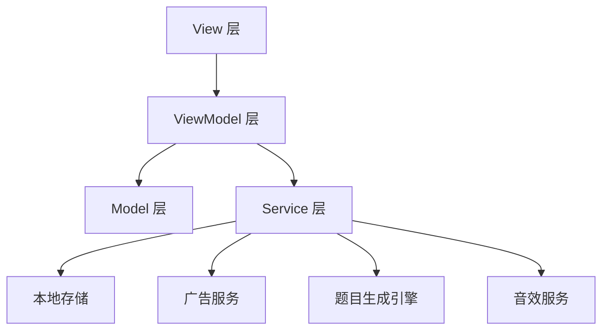

# Mathaxy iOS 开发计划

## 一、项目概述

### 1.1 项目信息
- **项目名称**: Mathaxy（数学银河）
- **Bundle ID**: com.magixun.mathaxywt
- **目标平台**: iOS 18及以上
- **目标设备**: iPhone 13及以上 + iPad（仅竖屏布局）
- **开发语言**: Swift
- **架构模式**: MVVM

### 1.2 核心目标
通过闯关模式，让小学一年级学生对10以内加法形成肌肉记忆，达到看到题目2秒内快速作答的熟练程度。

### 1.3 多语言支持
- 中文（简体）
- 繁体中文
- 英文
- 日语
- 韩语
- 西班牙语
- 葡萄牙语

---

## 二、技术架构

### 2.1 技术栈
- **UI框架**: SwiftUI
- **数据存储**: UserDefaults + FileManager（本地存储）
- **广告平台**: Google AdMob（测试广告位）
- **权限管理**: PhotosUI（相册访问）
- **多语言**: SwiftUI Localization

### 2.2 MVVM架构图



---

## 三、目录结构

```
Mathaxy-WT-iOS/
├── Mathaxy/
│   ├── App/
│   │   ├── MathaxyApp.swift              # 应用入口
│   │   └── AppDelegate.swift             # 应用代理
│   │
│   ├── Modules/
│   │   ├── Login/                         # 登录模块
│   │   │   ├── View/
│   │   │   │   ├── LoginView.swift
│   │   │   │   └── ParentBindView.swift
│   │   │   ├── ViewModel/
│   │   │   │   └── LoginViewModel.swift
│   │   │   └── Model/
│   │   │       └── UserProfile.swift
│   │   │
│   │   ├── Game/                          # 游戏模块
│   │   │   ├── View/
│   │   │   │   ├── LevelSelectView.swift
│   │   │   │   ├── GamePlayView.swift
│   │   │   │   ├── ResultView.swift
│   │   │   │   └── GuideCharacterView.swift
│   │   │   ├── ViewModel/
│   │   │   │   ├── LevelSelectViewModel.swift
│   │   │   │   ├── GamePlayViewModel.swift
│   │   │   │   └── ResultViewModel.swift
│   │   │   └── Model/
│   │   │       ├── Level.swift
│   │   │       ├── Question.swift
│   │   │       ├── GameSession.swift
│   │   │       └── GameResult.swift
│   │   │
│   │   ├── Achievement/                   # 成就模块
│   │   │   ├── View/
│   │   │   │   ├── BadgeCollectionView.swift
│   │   │   │   └── CertificateView.swift
│   │   │   ├── ViewModel/
│   │   │   │   └── AchievementViewModel.swift
│   │   │   └── Model/
│   │   │       ├── Badge.swift
│   │   │       ├── BadgeType.swift
│   │   │       ├── GuideCharacter.swift
│   │   │       └── Certificate.swift
│   │   │
│   │   ├── Settings/                      # 设置模块
│   │   │   ├── View/
│   │   │   │   └── SettingsView.swift
│   │   │   ├── ViewModel/
│   │   │   │   └── SettingsViewModel.swift
│   │   │   └── Model/
│   │   │       └── AppSettings.swift
│   │   │
│   │   └── Home/                          # 首页模块
│   │       ├── View/
│   │       │   └── HomeView.swift
│   │       └── ViewModel/
│   │           └── HomeViewModel.swift
│   │
│   ├── Services/
│   │   ├── QuestionGenerator.swift        # 题目生成引擎
│   │   ├── StorageService.swift           # 数据存储服务
│   │   ├── AdService.swift                # 广告服务
│   │   ├── SoundService.swift             # 音效服务
│   │   ├── LocalizationService.swift      # 本地化服务
│   │   └── LoginTrackingService.swift     # 登录追踪服务
│   │
│   ├── Models/
│   │   ├── GameConstants.swift            # 游戏常量
│   │   └── LevelConfig.swift              # 关卡配置
│   │
│   ├── Resources/
│   │   ├── Assets.xcassets/               # 图片资源
│   │   ├── Sounds/                        # 音效文件
│   │   └── Colors/                        # 颜色定义
│   │
│   ├── Localization/
│   │   ├── Localizable.strings (中文)
│   │   ├── Localizable.strings (繁体中文)
│   │   ├── Localizable.strings (English)
│   │   ├── Localizable.strings (Japanese)
│   │   ├── Localizable.strings (Korean)
│   │   ├── Localizable.strings (Spanish)
│   │   └── Localizable.strings (Portuguese)
│   │
│   └── Utils/
│       ├── Extensions/
│       │   ├── View+Extensions.swift
│       │   ├── Color+Extensions.swift
│       │   └── String+Extensions.swift
│       └── Helpers/
│           ├── DateHelper.swift
│           └── CertificateGenerator.swift
│
├── MathaxyTests/
│   └── [单元测试文件]
│
└── MathaxyUITests/
    └── [UI测试文件]
```

---

## 四、核心功能模块设计

### 4.1 题目生成引擎

**功能描述**：
- 生成10以内加法题（加数、被加数均小于10）
- 同一关卡内不重复题目
- 支持连续进位题型（如3+8、5+7）

**数据模型**：
```swift
struct Question {
    let id: UUID
    let addend1: Int        // 被加数 (0-9)
    let addend2: Int        // 加数 (0-9)
    let correctAnswer: Int  // 正确答案 (0-18)
    let timeLimit: Double   // 时间限制（秒）
}
```

**算法逻辑**：
1. 随机生成加数和被加数（0-9）
2. 计算正确答案
3. 检查是否与当前关卡已生成的题目重复
4. 如重复则重新生成

---

### 4.2 关卡配置系统

**关卡配置**：

| 关卡 | 模式 | 时间限制 | 说明 |
|------|------|----------|------|
| 1 | 总时长 | 5分钟（平均15秒/题） | 适应期 |
| 2 | 总时长 | 4分钟（平均12秒/题） | 适应期 |
| 3 | 总时长 | 3分钟（平均9秒/题） | 适应期 |
| 4 | 总时长 | 2分钟（平均6秒/题） | 适应期 |
| 5 | 总时长 | 1分30秒（平均4.5秒/题） | 适应期 |
| 6 | 单题倒计时 | 4秒/题 | 秒答训练期 |
| 7 | 单题倒计时 | 3.5秒/题 | 秒答训练期 |
| 8 | 单题倒计时 | 3秒/题 | 秒答训练期 |
| 9 | 单题倒计时 | 2.5秒/题 | 秒答训练期 |
| 10 | 单题倒计时 | 2秒/题 | 秒答训练期 |

**数据模型**：
```swift
struct LevelConfig {
    let level: Int
    let mode: GameMode           // .totalTime 或 .perQuestion
    let totalTime: Double?        // 总时长（秒）
    let perQuestionTime: Double?  // 单题时间（秒）
    let maxErrors: Int           // 最大错误次数（仅单题模式）
}

enum GameMode {
    case totalTime      // 总时长模式
    case perQuestion    // 单题倒计时模式
}
```

---

### 4.3 游戏会话管理

**数据模型**：
```swift
struct GameSession {
    let id: UUID
    let level: Int
    let questions: [Question]
    var currentIndex: Int
    var correctCount: Int
    var errorCount: Int
    var startTime: Date
    var totalTime: Double
    var isCompleted: Bool
    var isFailed: Bool
    var lastTenAnswers: [(answer: Int, time: Double)]  // 用于跳关检测
}
```

**核心逻辑**：
- **总时长模式**：在规定时间内完成所有题目
- **单题倒计时模式**：每题在倒计时内作答，错误次数≥10次失败

---

### 4.4 跳关机制

**触发条件**：
- **第1-5关**：连续10题平均用时 < 当前关卡平均每题时间的1/2
- **第6-10关**：连续10题均在倒计时1/2时间内答对

**奖励**：
- 跳至当前关卡+3的关卡
- 获得"神速小能手"勋章

**实现逻辑**：
```swift
func checkSkipLevel(session: GameSession, levelConfig: LevelConfig) -> Bool {
    guard session.lastTenAnswers.count >= 10 else { return false }
    
    let lastTen = Array(session.lastTenAnswers.suffix(10))
    
    switch levelConfig.mode {
    case .totalTime(let totalTime):
        let avgTime = totalTime / 20.0
        let actualAvgTime = lastTen.map { $0.time }.reduce(0, +) / 10.0
        return actualAvgTime < avgTime / 2.0
        
    case .perQuestion(let perQuestionTime):
        let halfTime = perQuestionTime / 2.0
        return lastTen.allSatisfy { $0.time < halfTime && $0.answer == session.questions[session.currentIndex].correctAnswer }
    }
}
```

---

### 4.5 勋章系统

**勋章类型**：

| 勋章名称 | 获得条件 | 数量 |
|----------|----------|------|
| 加法小勇士 | 每通关1关获得 | 10枚 |
| 神速小能手 | 触发跳关获得 | 不限 |
| 答题小天才 | 单关20题全对 | 10枚 |
| 坚持小达人 | 连续登录7天 | 1枚 |

**数据模型**：
```swift
struct Badge {
    let id: UUID
    let type: BadgeType
    let level: Int?           // 关联关卡（仅加法小勇士、答题小天才）
    let earnedDate: Date
}

enum BadgeType {
    case levelComplete        // 加法小勇士
    case skipLevel            // 神速小能手
    case perfectLevel         // 答题小天才
    case consecutiveLogin     // 坚持小达人
}
```

---

### 4.6 卡通向导系统

**解锁条件**：
- 累计获得3枚勋章：解锁"银河小熊猫"
- 累计获得7枚勋章：解锁"银河小兔子"

**数据模型**：
```swift
struct GuideCharacter {
    let id: UUID
    let name: String
    let type: CharacterType
    let unlockThreshold: Int  // 解锁所需的勋章数量
    let isUnlocked: Bool
    let messages: [String: [String]]  // 多语言消息
}

enum CharacterType {
    case panda    // 银河小熊猫
    case rabbit   // 银河小兔子
}
```

**消息示例**：
- 小熊猫：
  - 中文："你好厉害呀！"
  - 英文："Great job!"
  - 日语："すごいですね！"
- 小兔子：
  - 日文："答えは 10 より小さいですよ～"
  - 韩文："정답은 10보다 작아요～"

---

### 4.7 连续登录系统

**功能描述**：
- 基于日历日期判定
- 中断后重新开始计算
- 连续7天获得"坚持小达人"勋章

**数据模型**：
```swift
struct LoginRecord {
    let lastLoginDate: Date
    let consecutiveDays: Int
    let hasEarnedBadge: Bool
}
```

**实现逻辑**：
```swift
func updateLoginRecord() {
    let today = Calendar.current.startOfDay(for: Date())
    let lastLogin = Calendar.current.startOfDay(for: lastLoginDate)
    
    let daysDifference = Calendar.current.dateComponents([.day], from: lastLogin, to: today).day ?? 0
    
    if daysDifference == 1 {
        consecutiveDays += 1
    } else if daysDifference > 1 {
        consecutiveDays = 1  // 中断，重新开始
    }
    
    if consecutiveDays >= 7 && !hasEarnedBadge {
        earnBadge(type: .consecutiveLogin)
    }
}
```

---

### 4.8 奖状生成系统

**功能描述**：
- 通关第10关后自动生成电子奖状
- 包含：昵称、通关总用时、获得勋章数量、卡通银河背景+小熊猫形象
- 支持保存到相册、分享至社交平台

**数据模型**：
```swift
struct Certificate {
    let id: UUID
    let nickname: String
    let completionDate: Date
    let totalTime: Double
    let badgeCount: Int
    let backgroundImage: UIImage
    let characterImage: UIImage
}
```

**实现方式**：
- 使用SwiftUI的ImageRenderer将奖状视图渲染为UIImage
- 导出PNG格式
- 使用PhotosUI保存到相册

---

### 4.9 失败机制

**触发条件**：
- **总时长模式**：超时未完成
- **单题倒计时模式**：错误次数≥10次

**处理方式**：
- 弹出二选一选项：
  1. "观看30秒广告→重新挑战本关"
  2. "返回首页→下次再试"
- 使用AdMob激励视频广告（测试广告位）

---

## 五、UI设计规范

### 5.1 整体风格
- **风格**：卡通银河风
- **主色调**：星空蓝 + 荧光黄
- **点缀元素**：星星、小星球
- **设计原则**：避免复杂装饰干扰答题

### 5.2 颜色定义

```swift
enum AppColor {
    static let spaceBlue = Color(hex: "#1A1A2E")
    static let starlightYellow = Color(hex: "#FFD700")
    static let nebulaPurple = Color(hex: "#4B0082")
    static let galaxyPink = Color(hex: "#FF6B9D")
    static let cometWhite = Color(hex: "#FFFFFF")
    static let alertRed = Color(hex: "#FF4444")
    static let successGreen = Color(hex: "#00C851")
}
```

### 5.3 字体规范

```swift
enum AppFont {
    static let title = Font.system(size: 32, weight: .bold)
    static let heading = Font.system(size: 24, weight: .semibold)
    static let body = Font.system(size: 18, weight: .regular)
    static let caption = Font.system(size: 14, weight: .medium)
    static let questionNumber = Font.system(size: 48, weight: .bold)
}
```

### 5.4 界面布局规范

#### 5.4.1 登录页
- 顶部：应用Logo + 名称
- 中部：登录选项（游客登录 / 家长辅助绑定）
- 底部：版本信息

#### 5.4.2 闯关页
- 顶部：关卡进度 + 当前关卡信息
- 中部：题目（大号字体，居中显示）
- 题目下方：倒计时数字（红色加粗）
- 底部：答题按钮（数字0-20，横向排列，避免误触）

#### 5.4.3 结果页
- 顶部：结果图标（通关/失败）
- 中部：结果信息 + 获得勋章动画
- 底部：操作按钮（继续挑战 / 返回首页 / 观看广告重试）

#### 5.4.4 奖状页
- 中部：奖状预览（可缩放查看）
- 底部：保存到相册 / 分享按钮
- 提示："可打印成纸质奖状哦！"

### 5.5 适配规范

#### iPhone适配
- 支持iPhone 13及以上机型
- 自动适配刘海屏 / 灵动岛
- 使用GeometryReader获取安全区域

#### iPad适配
- 仅竖屏布局
- 使用HStack/VStack + Spacer实现响应式布局
- 按钮尺寸适当放大，避免误触

---

## 六、数据存储方案

### 6.1 存储内容
- 用户昵称
- 闯关进度
- 勋章列表
- 连续登录记录
- 奖状数据

### 6.2 存储方式
- **UserDefaults**：存储轻量级数据（昵称、语言设置、登录记录）
- **FileManager**：存储复杂数据（闯关进度、勋章列表、奖状）

### 6.3 数据模型

```swift
struct UserData: Codable {
    var nickname: String
    var language: String
    var levelProgress: Int  // 当前关卡
    var completedLevels: Set<Int>
    var badges: [Badge]
    var loginRecord: LoginRecord
    var certificates: [Certificate]
}
```

---

## 七、音效系统

### 7.1 音效类型

| 场景 | 音效 | 多语言语音 |
|------|------|------------|
| 答对 | 轻快"叮咚"声 | 儿童欢呼声（多语言） |
| 答错/超时 | 柔和"嘀"声 | 安慰语音（多语言） |
| 获得勋章 | 星空闪烁音效 | 角色语音问候 |
| 解锁角色 | 星空闪烁音效 | 角色语音问候 |

### 7.2 多语言语音示例

- 中文："太棒了！" / "再试一次"
- 英文："Excellent!" / "Try again"
- 日语："すばらしい！" / "もう一度"
- 韩语："훌륭해요!" / "다시 시도해보세요"
- 西班牙语："¡Excelente!" / "Inténtalo de nuevo"
- 葡萄牙语："Excelente!" / "Tente novamente"

### 7.3 实现方式
- 使用AVFoundation播放音效
- 根据当前语言选择对应的语音文件

---

## 八、开发流程

### 8.1 第一阶段：基础框架搭建
1. 创建Xcode项目
2. 搭建MVVM目录结构
3. 配置多语言支持
4. 实现数据存储层
5. 实现题目生成引擎

### 8.2 第二阶段：核心功能开发
1. 实现登录模块
2. 实现游戏核心逻辑
3. 实现计时系统
4. 实现答题界面和交互
5. 实现失败机制和广告集成

### 8.3 第三阶段：成就系统开发
1. 实现勋章系统
2. 实现卡通向导解锁系统
3. 实现连续登录7天检测
4. 实现奖状生成和导出功能

### 8.4 第四阶段：UI优化和适配
1. 实现音效系统
2. 实现设置页面（语言切换）
3. 适配iPhone和iPad（竖屏布局）
4. UI动画和交互优化

### 8.5 第五阶段：测试和优化
1. 单元测试
2. UI测试
3. 性能优化
4. Bug修复

### 8.6 第六阶段：发布准备
1. 准备App Store截图和描述
2. 配置App Store Connect
3. 提交审核

---

## 九、权限管理

### 9.1 所需权限
- **相册访问权限**：用于保存奖状到相册

### 9.2 权限说明
- 首次使用时弹窗说明权限用途（多语言适配）
- 遵循COPPA儿童隐私政策

---

## 十、后续扩展（第一阶段不开发）

### 10.1 社交功能
- 好友系统
- 好友闯关排行榜
- 好友之间送鼓励贴纸

### 10.2 内容扩展
- 20以内加法
- 减法、乘法、除法模块
- 混合运算关卡

### 10.3 互动升级
- AR功能（扫描纸质奖状触发银河小怪兽动画）
- 家长端进度查看小程序

---

## 十一、开发注意事项

### 11.1 代码规范
- 所有代码需添加清晰的中文注释
- 系统权限相关逻辑必须重点标注
- 遵循Swift编码规范
- 使用SwiftUI最佳实践

### 11.2 性能优化
- 避免频繁的磁盘IO操作
- 使用懒加载优化内存使用
- 图片资源使用合适的尺寸和格式

### 11.3 测试策略
- 单元测试覆盖核心逻辑
- UI测试覆盖关键用户流程
- 真机测试覆盖iPhone和iPad

### 11.4 隐私和安全
- 遵循COPPA儿童隐私政策
- 所有数据本地存储，不上传服务器
- 明确说明权限用途

---

## 十二、交付物清单

### 12.1 代码
- 完整的iOS项目源代码
- 单元测试代码
- UI测试代码

### 12.2 文档
- UI设计规范文档
- API文档（如有）
- 部署文档

### 12.3 资源
- 多语言字符串文件
- 音效文件
- 占位图资源

---

## 附录A：关键算法实现

### A.1 题目生成算法
```swift
class QuestionGenerator {
    static func generateQuestions(level: Int, count: Int = 20) -> [Question] {
        var questions: [Question] = []
        var usedCombinations: Set<String> = []
        
        let levelConfig = LevelConfig.getLevelConfig(level)
        
        while questions.count < count {
            let addend1 = Int.random(in: 0...9)
            let addend2 = Int.random(in: 0...9)
            let correctAnswer = addend1 + addend2
            let combination = "\(addend1)+\(addend2)"
            
            if !usedCombinations.contains(combination) {
                usedCombinations.insert(combination)
                
                let question = Question(
                    id: UUID(),
                    addend1: addend1,
                    addend2: addend2,
                    correctAnswer: correctAnswer,
                    timeLimit: levelConfig.perQuestionTime ?? 0
                )
                questions.append(question)
            }
        }
        
        return questions
    }
}
```

### A.2 跳关检测算法
```swift
func checkSkipCondition(session: GameSession, levelConfig: LevelConfig) -> Bool {
    guard session.lastTenAnswers.count >= 10 else { return false }
    
    let recentAnswers = Array(session.lastTenAnswers.suffix(10))
    
    switch levelConfig.mode {
    case .totalTime(let totalTime):
        let avgTimePerQuestion = totalTime / 20.0
        let actualAvgTime = recentAnswers.map { $0.time }.reduce(0, +) / 10.0
        return actualAvgTime < avgTimePerQuestion / 2.0
        
    case .perQuestion(let perQuestionTime):
        let halfTime = perQuestionTime / 2.0
        return recentAnswers.allSatisfy { answer in
            answer.time < halfTime && answer.answer == session.questions[session.currentIndex].correctAnswer
        }
    }
}
```

---

## 附录B：多语言字符串示例

### B.1 通用字符串
```
// 中文
"app_name" = "数学银河";
"level" = "关卡";
"question" = "题目";
"time" = "时间";
"score" = "得分";
"badge" = "勋章";

// English
"app_name" = "Mathaxy";
"level" = "Level";
"question" = "Question";
"time" = "Time";
"score" = "Score";
"badge" = "Badge";
```

### B.2 游戏界面字符串
```
// 中文
"congratulations" = "恭喜通关！";
"try_again" = "差一点哦！";
"watch_ad_retry" = "观看30秒广告→重新挑战本关";
"back_to_home" = "返回首页→下次再试";

// English
"congratulations" = "Congratulations!";
"try_again" = "So close!";
"watch_ad_retry" = "Watch 30s Ad → Retry Level";
"back_to_home" = "Back to Home → Try Later";
```

---

## 附录C：测试用例

### C.1 题目生成测试
- 测试同一关卡内不重复题目
- 测试加数和被加数均小于10
- 测试连续进位题型（3+8、5+7）

### C.2 游戏逻辑测试
- 测试总时长模式的通关和失败
- 测试单题倒计时模式的通关和失败
- 测试跳关机制的触发条件

### C.3 勋章系统测试
- 测试通关勋章的获得
- 测试跳关勋章的获得
- 测试完美勋章的获得
- 测试连续登录7天勋章的获得

### C.4 多语言测试
- 测试界面文字的多语言切换
- 测试音效的多语言适配
- 测试奖状内容的多语言适配

---

**文档版本**: v1.0
**创建日期**: 2026-01-19
**最后更新**: 2026-01-19
